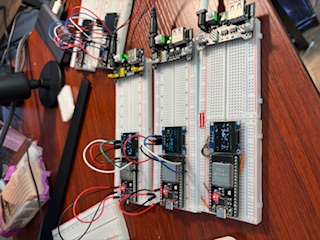

# MeshSwarm

[](https://github.com/edlovesjava/MeshSwarm/actions/workflows/ci.yml)
[](https://registry.platformio.org/libraries/edlovesjava/MeshSwarm)

A self-organizing ESP32 mesh network library with distributed shared state synchronization.

## Core principles
* privacy and autonomy first
* collective intelligence in action
* small and cheap but powerful in the aggregate
* play as a skill: always have fun

## Features

- **Self-organizing mesh**: Nodes automatically discover and connect using painlessMesh
- **Coordinator election**: Lowest node ID automatically becomes coordinator
- **Self-healing**: Network recovers from node failures and re-elects coordinators
- **Distributed shared state**: Key-value store synchronized across all nodes
- **State watchers**: Register callbacks to react to state changes
- **Conflict resolution**: Version numbers + origin ID ensure deterministic convergence
- **OTA updates**: Receive firmware updates via mesh from gateway *(optional)*
- **Telemetry**: Send metrics to server via gateway node *(optional)*
- **OLED display**: Built-in support for SSD1306 128x64 displays *(optional)*
- **Serial console**: Built-in command interface for debugging and control *(optional)*
- **Modular architecture**: Disable unused features to reduce flash usage by up to 65KB

## Modular Build System

MeshSwarm supports **feature flags** to disable optional components and reduce flash memory usage:

```cpp
// Disable features before including MeshSwarm.h
#define MESHSWARM_ENABLE_DISPLAY 0    // Save ~10-15KB
#define MESHSWARM_ENABLE_SERIAL 0     // Save ~8-12KB
#define MESHSWARM_ENABLE_TELEMETRY 0  // Save ~12-18KB
#define MESHSWARM_ENABLE_OTA 0        // Save ~15-20KB
#include <MeshSwarm.h>
```

**Flash savings:**
- Full build: 58-84KB
- Core only: 15-20KB (**saves ~40-65KB!**)

### Log Levels

Control logging verbosity to further reduce flash usage:

```cpp
// Set log level before including MeshSwarm.h
#define MESHSWARM_LOG_LEVEL MESHSWARM_LOG_ERROR  // Errors only
#include <MeshSwarm.h>
```

| Level | Value | Description |
|-------|-------|-------------|
| `MESHSWARM_LOG_NONE` | 0 | No logging (maximum flash savings) |
| `MESHSWARM_LOG_ERROR` | 1 | Errors only |
| `MESHSWARM_LOG_WARN` | 2 | Errors + Warnings |
| `MESHSWARM_LOG_INFO` | 3 | Errors + Warnings + Info **(default)** |
| `MESHSWARM_LOG_DEBUG` | 4 | All messages including debug |

Setting `MESHSWARM_LOG_LEVEL` to `ERROR` or `NONE` can save an additional **4-8KB** of flash.

See **[docs/MODULAR_BUILD.md](docs/MODULAR_BUILD.md)** for complete documentation.

## Installation

### Arduino IDE

Copy this `MeshSwarm` folder to your Arduino libraries directory:

```bash
# macOS
cp -r MeshSwarm ~/Documents/Arduino/libraries/

# Linux
cp -r MeshSwarm ~/Arduino/libraries/

# Windows
# Copy to: Documents\Arduino\libraries\
```

Restart Arduino IDE after copying.

### PlatformIO

**Recommended for development.** See **[docs/PLATFORMIO_GUIDE.md](docs/PLATFORMIO_GUIDE.md)** for complete guide.

Quick start:
```bash
# Clone or copy library to your project
git clone https://github.com/edlovesjava/MeshSwarm.git

# Navigate to project and compile
cd MeshSwarm
pio run -e esp32

# Upload to device
pio run -e esp32 --target upload
```

The library includes `platformio.ini` with pre-configured environments for:
- **Boards**: ESP32, ESP32-S3, ESP32-C3
- **Feature flags**: Minimal, Display, Serial, Telemetry, OTA, Gateway
- **Testing**: Automated compilation validation

## Dependencies

Install via Arduino Library Manager:

- painlessMesh
- ArduinoJson
- Adafruit SSD1306
- Adafruit GFX Library

## Quick Start

```cpp
#include <MeshSwarm.h>

MeshSwarm swarm;

void setup() {
  swarm.begin();

  // React to state changes from other nodes
  swarm.watchState("led", [](const String& key, const String& value, const String& oldValue) {
    digitalWrite(2, value == "1" ? HIGH : LOW);
  });
}

void loop() {
  swarm.update();
}
```

## Hardware

### Required
- ESP32 (dual-core recommended)
- SSD1306 OLED 128x64 (I2C)

### Default Pin Configuration

| Component | ESP32 Pin |
|-----------|-----------|
| OLED SDA  | GPIO 21   |
| OLED SCL  | GPIO 22   |

Pins can be overridden by defining before including:

```cpp
#define I2C_SDA 21
#define I2C_SCL 22
#include <MeshSwarm.h>
```

## API Reference

### Initialization

```cpp
MeshSwarm swarm;

// Default network settings
swarm.begin();

// Custom network settings
swarm.begin("mynetwork", "password123", 5555);

// With custom node name
swarm.begin("mynetwork", "password123", 5555, "sensor1");
```

### Main Loop

```cpp
void loop() {
  swarm.update();  // Must be called frequently
}
```

### State Management

```cpp
// Set state (broadcasts to all nodes)
swarm.setState("temperature", "23.5");

// Get state
String temp = swarm.getState("temperature");
String humid = swarm.getState("humidity", "0");  // With default

// Watch for changes
swarm.watchState("motion", [](const String& key, const String& value, const String& oldValue) {
  Serial.printf("%s changed: %s -> %s\n", key.c_str(), oldValue.c_str(), value.c_str());
});

// Watch all changes (wildcard)
swarm.watchState("*", [](const String& key, const String& value, const String& oldValue) {
  // Called for any state change
});

// Manual sync
swarm.broadcastFullState();  // Send all state to peers
swarm.requestStateSync();    // Request state from peers
```

### Node Information

```cpp
uint32_t id = swarm.getNodeId();      // Unique mesh ID
String name = swarm.getNodeName();    // Human-readable name
String role = swarm.getRole();        // "COORD" or "NODE"
bool coord = swarm.isCoordinator();   // Am I coordinator?
int peers = swarm.getPeerCount();     // Connected peer count
```

### Customization Hooks

```cpp
// Add custom logic to each loop iteration
swarm.onLoop([]() {
  // Poll sensors, update state, etc.
});

// Add custom serial commands
swarm.onSerialCommand([](const String& input) -> bool {
  if (input == "mycommand") {
    Serial.println("Handled!");
    return true;  // Command was handled
  }
  return false;  // Not our command
});

// Add custom display section
swarm.onDisplayUpdate([](Adafruit_SSD1306& display, int startLine) {
  display.println("---------------------");
  display.println("Custom data here");
});

// Set custom status line
swarm.setStatusLine("Sensor OK");

// Add data to heartbeat messages
swarm.setHeartbeatData("battery", 85);
```

### Advanced Access

```cpp
// Direct access to painlessMesh
painlessMesh& mesh = swarm.getMesh();

// Direct access to display
Adafruit_SSD1306& display = swarm.getDisplay();

// Access peer map
std::map<uint32_t, Peer>& peers = swarm.getPeers();
```

## Configuration

Override defaults before including the library:

```cpp
// Network settings
#define MESH_PREFIX     "myswarm"
#define MESH_PASSWORD   "secret123"
#define MESH_PORT       5555

// Display settings
#define SCREEN_WIDTH    128
#define SCREEN_HEIGHT   64
#define OLED_ADDR       0x3C

// I2C pins
#define I2C_SDA         21
#define I2C_SCL         22

// Timing (milliseconds)
#define HEARTBEAT_INTERVAL   5000
#define STATE_SYNC_INTERVAL  10000
#define DISPLAY_INTERVAL     500

#include <MeshSwarm.h>
```

## Built-in Serial Commands

| Command | Description |
|---------|-------------|
| `status` | Show node info (ID, role, peers, heap) |
| `peers` | List all known peers |
| `state` | Show all shared state entries |
| `set <key> <value>` | Set a shared state value |
| `get <key>` | Get a shared state value |
| `sync` | Broadcast full state to all nodes |
| `reboot` | Restart the node |

## State Conflict Resolution

When multiple nodes update the same key simultaneously:

1. Higher version number wins
2. If versions match, lower origin node ID wins

This ensures all nodes converge to the same state without a central authority.

## OTA Updates

### Receiving OTA Updates (Nodes)

```cpp
#include <MeshSwarm.h>
#include <esp_ota_ops.h>

void setup() {
  // Mark current firmware as valid (enables auto-rollback on boot failure)
  esp_ota_mark_app_valid_cancel_rollback();

  swarm.begin("PIR");
  swarm.enableOTAReceive("pir");  // Register to receive OTA for this role
}
```

### Distributing OTA Updates (Gateway)

```cpp
void setup() {
  esp_ota_mark_app_valid_cancel_rollback();
  swarm.begin("Gateway");
  swarm.connectToWiFi(ssid, password);
  swarm.setGatewayMode(true);
  swarm.enableOTADistribution(true);
}

void loop() {
  swarm.update();
  swarm.checkForOTAUpdates();  // Poll server every 60 seconds
}
```

### OTA Methods

| Method | Description |
|--------|-------------|
| `enableOTAReceive(role)` | Enable node to receive OTA for given role |
| `enableOTADistribution(bool)` | Enable gateway OTA distribution |
| `checkForOTAUpdates()` | Poll server for pending updates (gateway only) |

## Telemetry

### Sending Telemetry via Gateway

```cpp
void setup() {
  swarm.begin("Sensor");
  swarm.enableTelemetry(true);  // Sends via mesh to gateway
}
```

### Gateway Mode

```cpp
void setup() {
  swarm.begin("Gateway");
  swarm.connectToWiFi(ssid, password);
  swarm.setGatewayMode(true);
  swarm.setTelemetryServer("http://server:8000");
  swarm.enableTelemetry(true);
}
```

### Telemetry Methods

| Method | Description |
|--------|-------------|
| `enableTelemetry(bool)` | Enable/disable telemetry |
| `setTelemetryServer(url)` | Set server URL (gateway only) |
| `setTelemetryInterval(ms)` | Set push interval (default 30s) |
| `setGatewayMode(bool)` | Enable gateway mode |
| `connectToWiFi(ssid, pass)` | Connect to WiFi (gateway only) |

## Creating New Node Types

This step-by-step guide explains how to create custom mesh nodes for different sensors, actuators, or displays.

### Step 1: Choose Your Starting Point

| If you want... | Start with... |
|----------------|---------------|
| Simple sensor/actuator | `MinimalNode` or `WatcherNode` |
| Built-in OLED display | `BasicNode` |
| Custom display (TFT, etc.) | `MinimalNode` with `MESHSWARM_ENABLE_DISPLAY 0` |
| Gateway/server bridge | `GatewayNode` |

### Step 2: Create Node Skeleton

```cpp
#include <MeshSwarm.h>

MeshSwarm swarm;

void setup() {
  Serial.begin(115200);
  swarm.begin("MyNodeName");  // Unique name for this node
}

void loop() {
  swarm.update();  // Required - handles mesh communication
}
```

### Step 3: Add Sensor (Publishing Data)

To publish data from your node to the mesh:

```cpp
// In setup() - add periodic sensor reading
swarm.onLoop([]() {
  static unsigned long lastRead = 0;
  if (millis() - lastRead < 5000) return;  // Read every 5 seconds
  lastRead = millis();

  float value = readMySensor();  // Your sensor reading code
  swarm.setState("mykey", String(value, 1));  // Publish to mesh
});
```

**Key points:**
- Use `setState(key, value)` to publish - all nodes receive it automatically
- Choose descriptive keys like `temp`, `motion`, `humidity`
- Only publish when values change significantly to reduce network traffic

### Step 4: Add Actuator (Consuming Data)

To react to data from other nodes:

```cpp
// In setup() - register state watcher
swarm.watchState("motion", [](const String& key, const String& value, const String& oldValue) {
  if (value == "1") {
    digitalWrite(LED_PIN, HIGH);  // React to motion
  } else {
    digitalWrite(LED_PIN, LOW);
  }
});
```

**Key points:**
- Watchers are called automatically when state changes anywhere in mesh
- Use `"*"` as key to watch ALL state changes
- You can watch multiple keys by calling `watchState()` multiple times

### Step 5: Using Custom Displays

To use a different display (not the built-in SSD1306):

```cpp
// Disable MeshSwarm's built-in display BEFORE including
#define MESHSWARM_ENABLE_DISPLAY 0
#include <MeshSwarm.h>
#include <YourDisplayLibrary.h>

YourDisplay display;

void setup() {
  Serial.begin(115200);
  display.begin();  // Initialize your display

  swarm.begin("DisplayNode");

  // Watch data you want to display
  swarm.watchState("temp", [](const String& key, const String& value, const String& oldValue) {
    display.clear();
    display.print("Temp: " + value);
    display.update();
  });
}
```

### Step 6: Add PlatformIO Environment (Optional)

If using PlatformIO, add to `platformio.ini`:

```ini
[env:mynode]
build_src_filter = +<mynode/>
lib_deps =
    ${env.lib_deps}
    ; Add your sensor/display libraries here
build_flags =
    ${env.build_flags}
    -DNODE_TYPE=\"mynode\"
    -DNODE_NAME=\"MyNode\"
    ; Add feature flags if needed
    ; -DMESHSWARM_ENABLE_DISPLAY=0
```

### Complete Example: Clock Node with Custom TFT

A clock node using a round TFT display that shows time and temperature from mesh:

```cpp
// Disable built-in display - we use our own TFT
#define MESHSWARM_ENABLE_DISPLAY 0
#include <MeshSwarm.h>
#include <DIYables_TFT_Round.h>
#include <time.h>

MeshSwarm swarm;
DIYables_TFT_GC9A01_Round tft(27, 25, 26);  // RST, DC, CS

String meshTemp = "--";

void setup() {
  Serial.begin(115200);

  tft.begin();
  tft.fillScreen(0x0000);

  swarm.begin("Clock");

  // Watch temperature from DHT sensor nodes
  swarm.watchState("temp", [](const String& key, const String& value, const String& oldValue) {
    meshTemp = value;
  });

  // Configure NTP for time
  configTime(-18000, 3600, "pool.ntp.org");  // EST timezone
}

void loop() {
  swarm.update();
  updateClockDisplay();  // Your display update code
}
```

### Common Patterns

| Pattern | Code |
|---------|------|
| Publish sensor value | `swarm.setState("temp", String(value, 1));` |
| React to state change | `swarm.watchState("key", callback);` |
| Watch all changes | `swarm.watchState("*", callback);` |
| Custom serial command | `swarm.onSerialCommand(callback);` |
| Periodic task | `swarm.onLoop(callback);` |
| Get current state | `String v = swarm.getState("key");` |
| Enable OTA updates | `swarm.enableOTAReceive("nodetype");` |
| Enable telemetry | `swarm.enableTelemetry(true);` |

## Examples

This library includes the following example sketches (File → Examples → MeshSwarm):

| Example | Description |
|---------|-------------|
| **BasicNode** | Full-featured mesh node with OLED display (default config) |
| **MinimalNode** | Core-only build (~15-20KB) - no display, serial, telemetry, or OTA |
| **DisplayOnlyNode** | Core + Display (~30-40KB) - visual feedback without extras |
| **ButtonNode** | Button input that publishes to mesh |
| **LedNode** | LED controlled by mesh state |
| **SensorNode** | DHT11 temperature/humidity sensor |
| **WatcherNode** | Observer that logs all state changes |
| **GatewayNode** | WiFi bridge with telemetry and OTA |

## Sample image of nodes



## Related Projects

- [iotmesh](https://github.com/edlovesjava/iotmesh) - Complete IoT mesh application with server, dashboard, and OTA system

## Contributing

Contributions are welcome! Please feel free to submit a Pull Request.

## License

MIT License - see [LICENSE](LICENSE) file for details.
